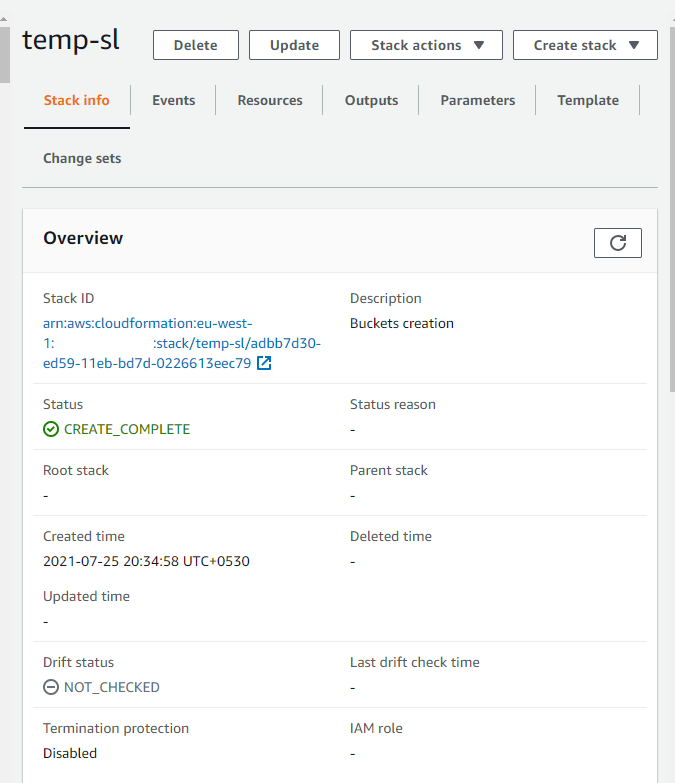

# Data-Streaming-Using-Aws-Kinesis-Lambda-S3
A production grade data pipeline that streams real time data of an online retailer website into AWS S3 data lake. The pipeline uses AWS Kinesis to receive real time streaming data and a lambda consumer which puts data into S3 data-lake.

### Project Description

An online retailer company is interested in understanding `user shopping patterns` and build prediction 
models to show ads for products that the user would be interested to buy based on the model.

To enable above prediction modelling it is required to build a `real-time` streaming pipeline
which gets user events/data points captured by the retailer's website into AWS S3 data-lake. From
where the prediction model code can pick up the data. As par tof this project we are only interested
in building the live-stream pipeline to get this data onto data-lake.

### Data Description

Below shows a sample json file that is created by the data points captured and sent to our data pipeline 
via Apache AMQ.

From the above json structure we can see that `metadata` tag is of some interest 
we could use the information in this to partition how data is being stored in the S3 destination bucket.
An effective partitioning strategy would ensure fast retrieval in the downstream pyspark jobs when processing the 
incoming data.

### Data pipeline design 

For this pipeline formation of incoming json and sending that to kinesis stream would be considered 
as external systems and our pipeline starts once we receive the payload onto the stream this can be done 
via Apache AMQ and a deque script or the Application can directly submit data into the stream using AWS Api calls.

Now lets talk about components of our pipeline 

*Aws Kinesis Stream*

Amazon Kinesis Data Streams (KDS) is a massively scalable and durable real-time data streaming service. KDS can continuously capture gigabytes of data per second from hundreds of thousands of sources such as website clickstreams, database event streams, financial transactions, social media feeds, IT logs, and location-tracking events. The data collected is available in milliseconds to enable real-time analytics use cases such as real-time dashboards, real-time anomaly detection, dynamic pricing, and more.
More information can be found [here](https://aws.amazon.com/kinesis/data-streams/).

We make a design decision to specifically choose streams instead of Kinesis Fire Hose(cheaper option) as we want more real time processing
and the latter is aligned to more of batch processing approach.

*Aws Lambda*

AWS Lambda is a serverless compute service that lets you run code without provisioning or managing servers, creating workload-aware cluster scaling logic, maintaining event integrations, or managing runtimes. With Lambda, you can run code for virtually any type of application or backend service - all with zero administration.
More information can be found [here](https://aws.amazon.com/lambda/).

The lambda function in our pipeline is mapped to the kinesis stream , once the stream receives the message
it is forwarded to lambda function. The function is responsible for doing basic validation on the payload
and also look at the `metadata` tag to determine which partition the message needs to be saved to.

Also in case any of any exception or if the payload fails the validation then we move the input packet
to `failed-s3-bucket`.

### Project Structure

Below snapshot shows the project structure 

*cf-templates* -> contains template required to deploy the project
*lib* -> contains code for lambda scripts
*tests* -> contains test script and mocked up data which pushes data to kinesis to test the pipeline 
end to end. 

### Deployment  

For deploying our AWS components we would be using AWS cloud formation templates.
AWS CloudFormation gives you an easy way to model a collection of related AWS and third-party resources, provision them quickly and consistently, and manage them throughout their lifecycles, by treating infrastructure as code. A CloudFormation template describes your desired resources and their dependencies so you can launch and configure them together as a stack. You can use a template to create, update, and delete an entire stack as a single unit, as often as you need to, instead of managing resources individually. You can manage and provision stacks across multiple AWS accounts and AWS Regions.

More details on CF template can be found (here)[https://aws.amazon.com/cloudformation/].

Resources in the template

Deployed template:

*Deployed Resources*

*s3 destination bucket partitioning*

### Testing 

For testing this project refer to the test script given under `tests` folder.
The script connects to the kinesis stream and sends payloads(json) kept in `./tests/data` folder.
Below is screen-shot of running this from my local Jupyter notebook

   

